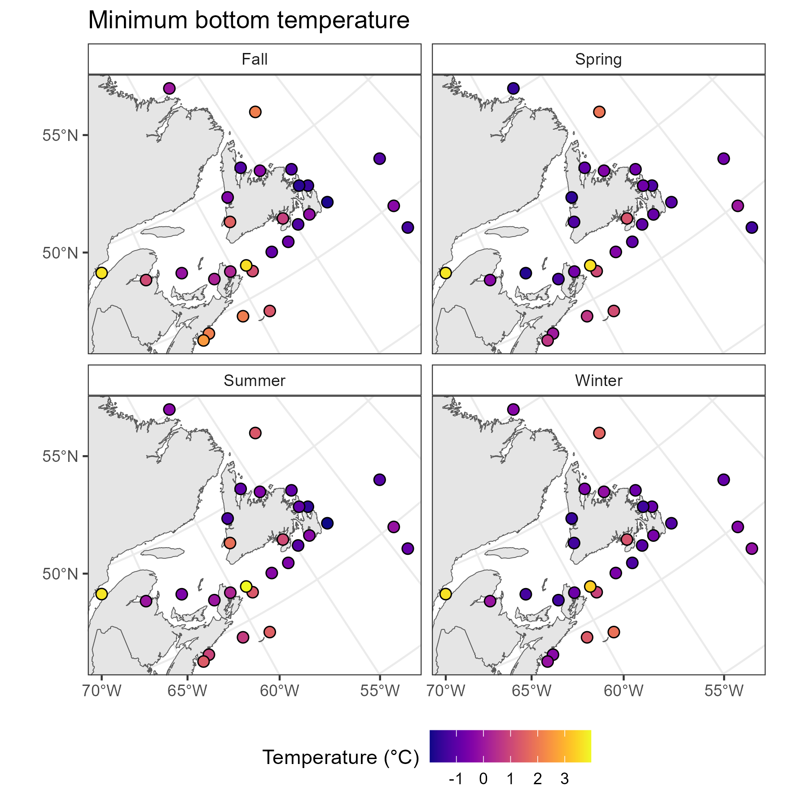
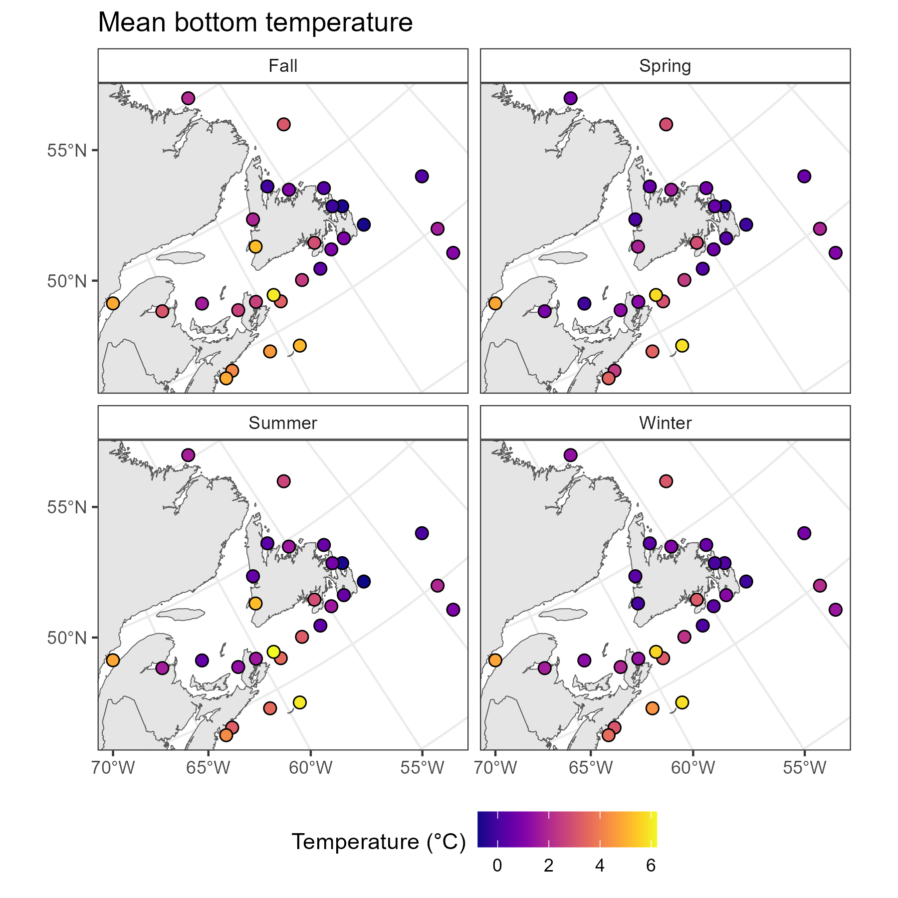

# SnowCrabGenomics
Bioinformatics scripts and R scripts for snow crab RNA transcriptome assembly, whole reference genome assembly and annotation, and SNP genotyping. 

__Contact:__      nick.jeffery@dfo-mpo.gc.ca

### Project Components
1. Genome assembly using long and short read sequencing with HiC chromatin capture
2. Genome annotation
3. Transcriptome assembly using RNA-seq from five tissues
4. Pool-seq of 15 snow crab populations across Atlantic Canada to examine population structure
5. Environmental association analysis

# Component 4: PoolSeq
### Sampling

__Figure 1__ Map of genetic sample locations overlaid on minimum winter bottom temperature based on the Bedford Institute of Oceanography North Atlantic Model (BNAM). Crab Fishing Areas (CFAs) overlaid. 

# Component 5: EAS

#Extractions from the Ditital Twin Ocean (DTO) - developed for the Northwest Atlantic

__Figure 2__ DTO extractions for minimum bottom temperature observed between 2004-2024 based the GLORYS ocean reanalysis model. Model is based on monthly average time steps.

__Figure 3__ DTO extractions for maximum bottom temperature observed between 2004-2024 based the GLORYS ocean reanalysis model. Model is based on monthly average time steps.

__Figure 4__ DTO extractions for mean bottom temperature observed between 2004-2024 based the GLORYS ocean reanalysis model. Model is based on monthly average time steps.
